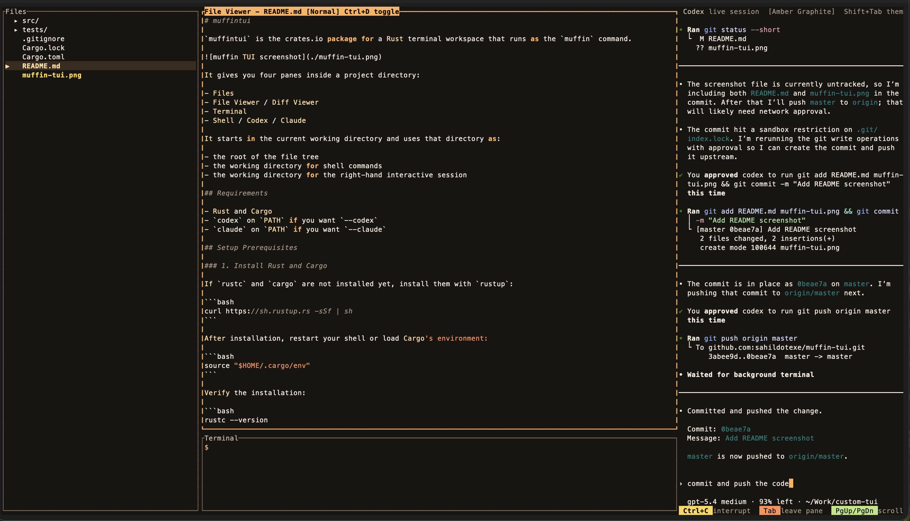

# muffintui

`muffintui` is the crates.io package for a Rust terminal workspace that runs as the `muffin` command.
It is designed to keep file navigation, shell work, and AI-assisted workflows in one terminal UI.



It gives you four panes inside a project directory:

- Files
- File Viewer / Diff Viewer
- Terminal
- Shell / Codex / Claude

It starts in the current working directory and uses that directory as:

- the root of the file tree
- the working directory for shell commands
- the working directory for the right-hand interactive session

## Requirements

- Rust and Cargo
- `codex` on `PATH` if you want `--codex`
- `claude` on `PATH` if you want `--claude`

## Setup Prerequisites

### 1. Install Rust and Cargo

If `rustc` and `cargo` are not installed yet, install them with `rustup`:

```bash
curl https://sh.rustup.rs -sSf | sh
```

After installation, restart your shell or load Cargo's environment:

```bash
source "$HOME/.cargo/env"
```

Verify the installation:

```bash
rustc --version
cargo --version
```

### 2. Install optional right-pane CLIs

By default, `muffin` starts a shell in the right pane.

If you want to start directly in Codex mode, verify that `codex` is available:

```bash
codex --version
```

If needed, authenticate it:

```bash
codex login
```

If you want to start directly in Claude mode, verify that `claude` is available:

```bash
claude --version
```

### 3. Sanity check

Before installing or running `muffin`, this should work:

```bash
cargo --version
```

## Install

Install from crates.io:

```bash
cargo install muffintui
```

This installs the executable as:

```bash
muffin
```

Install from the local checkout:

```bash
cargo install --path .
```

That local install also provides the `muffin` executable.

## Run

Launch in the current directory:

```bash
muffin
```

Launch with Codex in the right pane:

```bash
muffin --codex
```

Launch with Claude in the right pane:

```bash
muffin --claude
```

Launch against another project:

```bash
cd /path/to/project
muffin
```

Run without installing during local development:

```bash
cargo run
```

Pass startup flags through Cargo with an extra `--`:

```bash
cargo run -- --codex
cargo run -- --claude
```

## What It Does

- Shows a navigable file tree rooted at the current directory
- Highlights updated files and changed directories in the Files pane using the active theme
- Opens the selected file in a read-only file viewer
- Highlights source code in normal file view with theme-aware colors
- Toggles a diff viewer against `HEAD~1`
- Runs shell commands inside the built-in terminal pane with `sh -lc`
- Starts the right pane as a shell by default
- Can start the right pane with `codex` or `claude`
- Cycles between three built-in themes
- Ships with integration tests under `tests/`

Notes:

- `.git` and `target` are intentionally hidden from the file tree
- The built-in terminal pane starts empty
- Diff mode falls back to a message when the repository has no `HEAD~1`
- If the initial right-pane launch fails, pressing `Enter` in that pane retries the same mode
- If a `codex` or `claude` session exits, the app automatically switches that pane back to a shell
- If `codex` or `claude` is not installed, the rest of the TUI still works and the right pane shows the startup error

## Keybindings

### Global

- `Tab`: move focus to the next pane
- `Shift+Tab`: cycle the theme
- `Esc`: quit
- `Ctrl+C`: quit when focus is not in the Codex pane

### Files Pane

- `Up` or `k`: move selection up
- `Down` or `j`: move selection down
- `Enter` on a directory: expand or collapse it
- `Enter` on a file: open it in the file viewer

Notes:

- Files with git changes are highlighted
- Directories are highlighted when they contain changed files

### File Viewer / Diff Viewer

- `Ctrl+D`: toggle between file view and diff view
- `PageUp`: scroll up
- `PageDown`: scroll down

### Terminal Pane

- Type directly into the prompt
- `Enter`: run the current command
- `Backspace`: delete one character
- `PageUp`: scroll back
- `PageDown`: scroll forward
- `Home`: jump to the oldest visible terminal history
- `End`: jump back to the live prompt

### Right Pane

- Regular typing: send input to the active shell, Codex, or Claude session
- `Enter`: submit input, or retry the session if startup failed
- `Ctrl+C`: send interrupt to the active right-pane session
- `Arrow keys`, `PageUp`, `PageDown`, `Home`, `End`, `Tab`, `Backspace`: forwarded to the embedded session

## Publish

Before publishing:

```bash
cargo package
```

Then publish:

```bash
cargo publish
```

Contributions and issue reports are welcome.

## Test

Run the integration test suite with:

```bash
cargo test
```
